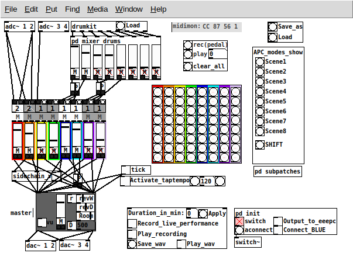

# eeelooper

Similar to [pdlooper](https://github.com/zigmhount/pdlooper), but written in vanilla Pure Data, and kept minimalistic with as few moving UI things as possible so that it runs smoothly on an old eeePC 701 (900Mhz Celeron with 2GB RAM).

Designed to be used together with audio input channels, a midi pad to load samples in a drumkit patch, and a midi control surface with 64 buttons and 9 faders, with no external software except Jack.

